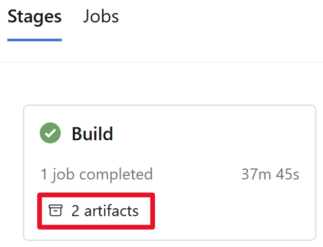
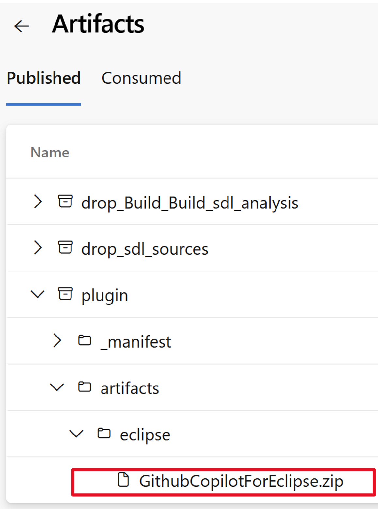

# GitHub Copilot for Eclipse
GitHub Copilot for Eclipse is a plugin that brings the power of [GitHub Copilot](https://github.com/features/copilot) to Eclipse. It provides AI-powered code completions and suggestions for Java, Python, and other languages.

## Prerequisites
- [Eclipse IDE](https://www.eclipse.org/downloads/)
- [Java 17](https://www.oracle.com/java/technologies/javase/jdk17-archive-downloads.html) or above
- An active [GitHub Copilot subscription](https://github.com/features/copilot)

## Getting Started
1. Find the latest release of the plugin from the [nightly build pipeline on Azure DevOps](https://mseng.visualstudio.com/VSJava/_build?definitionId=19562&_a=summary)

2. Open the latest relase pipeline and select artifacts under the `Build` job:

  

3. Select `GitHubCopilotForEclipse.zip` and download it:

  

4. Open Eclipse and go to `Help` -> `Install New Software...`:

  

5. Click `Add...` -> `Archive` and select the downloaded zip file:

  

6. Select the `GitHub Copilot` plugin and deselect `Contact all update sites during install to find required software`:

  

7. Click `Next` and finish the installation process:

  

8. Restart Eclipse, and the GitHub Copilot plugin is located on the bottom right corner. You are ready to use GitHub Copilot for Eclipse!

  

## Reporting Issues
Please report any issues or feedback on the [GitHub Copilot for Eclipse GitHub repository issues](https://github.com/microsoft/copilot-eclipse/issues/new?template=bug_report.md).

