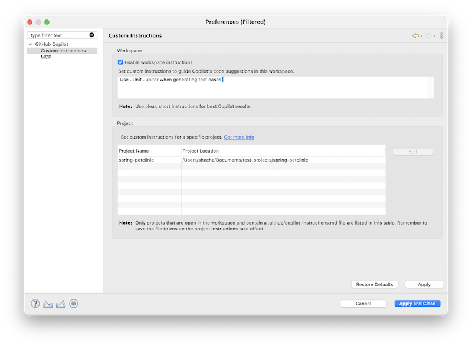
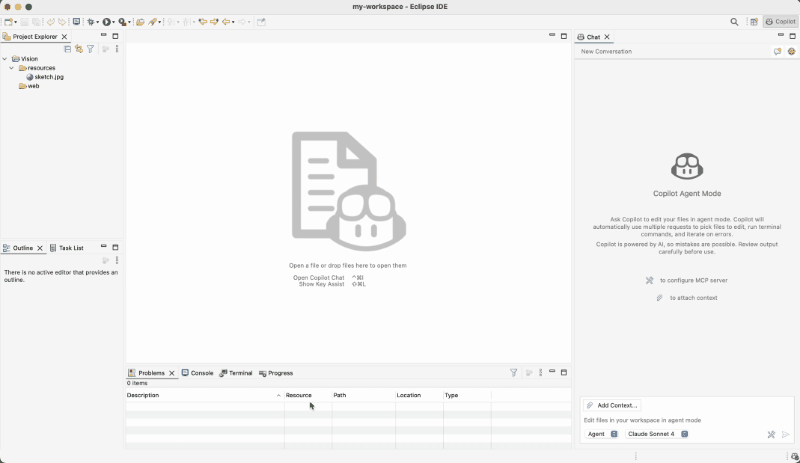
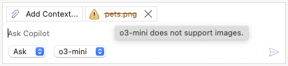
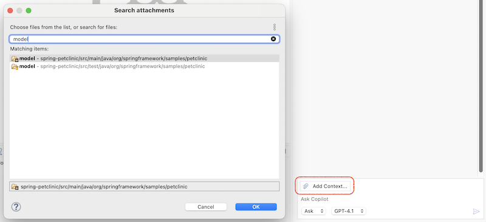
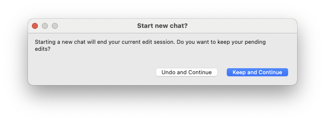
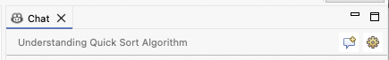

# GitHub Copilot 0.12.0 Release Notes
### Chat History is Here!
Now you can easily revisit your past conversations anytime. And you can also rename a chat to give it a meaningful title, or remove it with just a click.

<video controls="true" src="./0.12.0/chat_history.mp4" title="Chat History" style="max-width: 800px; width: 100%; height: auto;"></video>

---

### Bring Your Own Key (BYOK) - Now in Public Preview
Bring Your Own Key (BYOK) support is now in public preview. If you already have an API key from a supported model provider, you can connect it in just a minute and start using their models directly.

<video controls="true" src="./0.12.0/byok.mp4" title="Bring Your Own Key" style="max-width: 1000px; width: 100%; height: auto;"></video>

Note: BYOK is available only for individual plans - Free, Pro, and Pro+, with `Editor Preview Features` turned on in your [Copilot Settings](https://github.com/settings/copilot/features).

---

### Re-organized Preferences Page.
As Copilot continues to grow with exciting new features, we’ve redesigned the plug-in preferences page to make it cleaner, more intuitive, and easier for you to discover everything at a glance.


---

# GitHub Copilot 0.11.0 Release Notes
### More Convenient Ways to Add Chat Context
Adding context to your chats just got easier and more intuitive!
You now have multiple ways to include context files:

#### Drag and Drop

<video controls="true" src="./0.11.0/dnd.mp4" title="Drag and Drop"></video>

#### Right-Click from Explorer

<video controls="true" src="./0.11.0/context_menu.mp4" title="Right-Click from Explorer"></video>

---

### Enhanced Colors and Layout for Chat View
We’ve given the chat view a fresh coat of paint — and it looks better than ever!

#### Dark Theme Improvements


#### Light Theme Improvements


---

### Reduced Plugin Size
By splitting platform-specific binaries into separate fragments, the overall plugin size has been greatly reduced, which means faster downloads and updates.

---

### New Public API to Start a Chat Session Programmatically

We’ve introduced a new public API that allows other plugins to seamlessly start a new ask session in the Copilot chat view. Plug-ins can now invoke the command: `com.microsoft.copilot.eclipse.commands.openChatView` with two optional parameters:

- `com.microsoft.copilot.eclipse.commands.openChatView.inputValue`: A string representing the initial content of the chat.
- `com.microsoft.copilot.eclipse.commands.openChatView.autoSend`: A boolean indicating whether to automatically submit the content.

This opens up exciting possibilities for plugin developers to trigger contextual Copilot interactions directly from their tools.

#### Example: Spring Tools Plug-in Integration

Here’s how the Spring Tools plug-in leverages the new API to launch a chat session:

<video controls="true" src="./0.11.0/api.mp4" title="Spring Tools Plug-in Integration"></video>

---

# GitHub Copilot 0.10.0 Release Notes
### Custom Instructions Now Supported in Copilot
You can now use custom instructions to provide Copilot with additional context tailored to your work. This helps Copilot deliver more relevant and personalized assistance.

Check for [more details](https://docs.github.com/en/copilot/how-tos/configure-custom-instructions/add-repository-instructions).



---

### Image Support in Chat Context
You can now add images directly to the chat context. Check below example how Copilot interpret a hand-drawn layout page, and generate corresponding HTML code:



Note: Some models do not support vision capabilities. In such cases, a warning will be displayed.



---

### Folders Can Now Be Added to Chat Context
In addition to images, you can now attach entire folders to enrich the chat context. This makes it easier to share structured content and collaborate more effectively.



---

### MCP Support Enhancements in Copilot
Copilot now includes several enhancements for MCP support:

#### GitHub MCP Server OAuth Integration
You can now configure your GitHub MCP server using OAuth. Here's a sample configuration:

```javascript
{
  "servers": {
    "github": {
      "type": "http",
      "url": "https://api.githubcopilot.com/mcp/"
    }
  }
}
```

#### MCP Feature Flag Support
The Copilot plugin will automatically disable MCP features if it is turned off in the Copilot portal: https://github.com/settings/copilot/features, ensuring better alignment with your configuration settings.

---

### Improved UX for Starting New Conversations in Agent Mode
When creating a new conversation in agent mode, a confirmation dialog will now appear if there are any unhandled files in the current context. This helps prevent accidental data loss and ensures you don’t lose important changes unexpectedly.



---

### Chat View Banner Enhancements
The top banner in the chat view has been improved to enhance usability. It now displays the conversation title and includes a convenient Edit Preferences... shortcut button.


