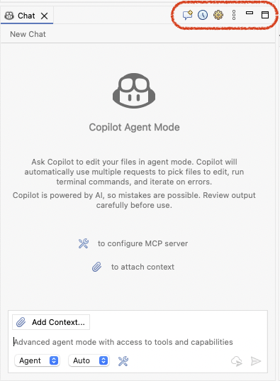

# GitHub Copilot 0.14.0 Release Notes
### Native Toolbar Integration
The buttons that used to sit on the chat view’s top bar have now found a new home in the Eclipse view’s toolbar. This change makes the interface feel more natural and integrated with your workflow.

Note: If you cannot see the new buttons, please delete the **workbench.xmi** file located at: `<your_workspace>/.metadata/.plugins/org.eclipse.e4.workbench/`.

---

### New Changed Files Panel
The new changed files panel is now scrollable, collapsible, and expandable, so you can dive into details when you need them and tuck it away when you don’t.

<video controls="true" src="./0.14.0/changed_file_box.mp4" title="Changed Files Panel" style="max-width: 800px; width: 100%; height: auto;"></video>

---

This release also squashed bugs, boosted performance, and polished the UI for a smoother, faster experience.

Thank you for being part of this journey — here’s to an even better year ahead!

🎉 Wishing you a Happy New Year! 🎉

---

# GitHub Copilot 0.13.0 Release Notes
### Custom Agent
Custom agents bring customization to your chat mode by letting you specify name, description, tools, and models. Create specialized AI teammates tailored to your workflows and coding standards in Eclipse. Define agents using Markdown files that specify prompts so you can pick them up and run in your Eclipse quickly.

<video controls="true" src="./0.13.0/custom_agent.mp4" title="Custom Agent" style="max-width: 800px; width: 100%; height: auto;"></video>

---

### Plan
`Plan` helps AI think before it acts. It creates a clear plan first, so you can review and adjust it to fit your needs — then let the AI get to work. Simple, smart, and under your control.

<video controls="true" src="./0.13.0/plan.mp4" title="Plan" style="max-width: 800px; width: 100%; height: auto;"></video>

---

### Sub-agent
With Sub-Agent, your custom agents can now work in harmony under the guidance of a main agent. Each sub-agent tackles a specific task within its own isolated context, free from distractions — delivering sharper, more accurate results. Think of it as a team of specialists, each focused on what they do best, all orchestrated for maximum impact.

<video controls="true" src="./0.13.0/sub_agent.mp4" title="Sub-agent" style="max-width: 800px; width: 100%; height: auto;"></video>

---

### Copilot Coding Agent
With Copilot coding agent, GitHub Copilot can work independently in the background to complete tasks, just like a human developer: creating pull requests to solve issues in your GitHub repos.

<video controls="true" src="./0.13.0/coding_agent.mp4" title="Copilot Coding Agent" style="max-width: 800px; width: 100%; height: auto;"></video>

Note: [Click here to check more information](https://aka.ms/learn-copilot-coding-agent)

---

### Next Edit Suggestions (NES)

Next Edit Suggestions (NES) in GitHub Copilot predicts your next changes based on recent edits. It suggests updates to code, comments, and tests, which you can preview and apply instantly. Use Tab to move through suggestions and press Tab again to accept—keeping your workflow smooth and uninterrupted.

<video controls="true" src="./0.13.0/nes.mp4" title="NES" style="max-width: 800px; width: 100%; height: auto;"></video>

---

### Auto Model
Auto optimizes for model availability, currently routing to GPT-5, GPT-5 mini, GPT-4.1, Sonnet 4.5, and Haiku 4.5, depending on your subscription type. More models are coming soon.

---

# GitHub Copilot 0.12.0 Release Notes
### Chat History is Here!
Now you can easily revisit your past conversations anytime. And you can also rename a chat to give it a meaningful title, or remove it with just a click.

<video controls="true" src="./0.12.0/chat_history.mp4" title="Chat History" style="max-width: 800px; width: 100%; height: auto;"></video>

---

### Bring Your Own Key (BYOK) - Now in Public Preview
Bring Your Own Key (BYOK) support is now in public preview. If you already have an API key from a supported model provider, you can connect it in just a minute and start using their models directly.

<video controls="true" src="./0.12.0/byok.mp4" title="Bring Your Own Key" style="max-width: 1000px; width: 100%; height: auto;"></video>

Note: BYOK is available only for individual plans - Free, Pro, and Pro+, with `Editor Preview Features` turned on in your [Copilot Settings](https://github.com/settings/copilot/features).

---

### Re-organized Preferences Page.
As Copilot continues to grow with exciting new features, we’ve redesigned the plug-in preferences page to make it cleaner, more intuitive, and easier for you to discover everything at a glance.

