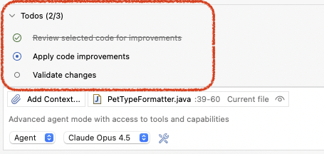
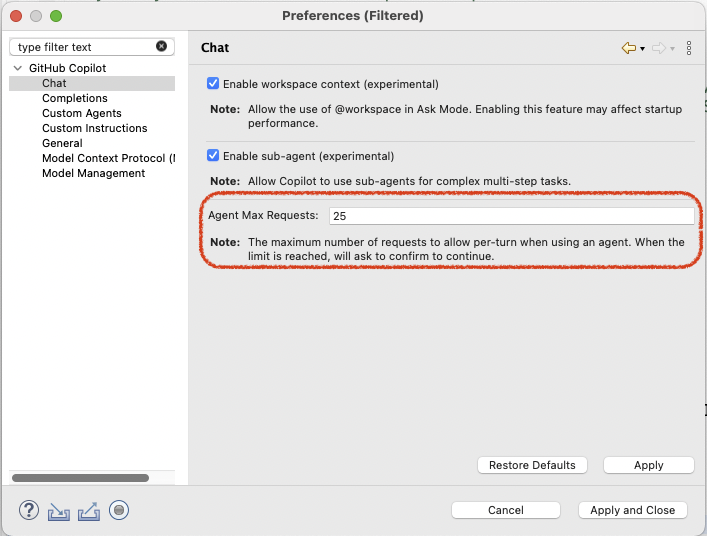
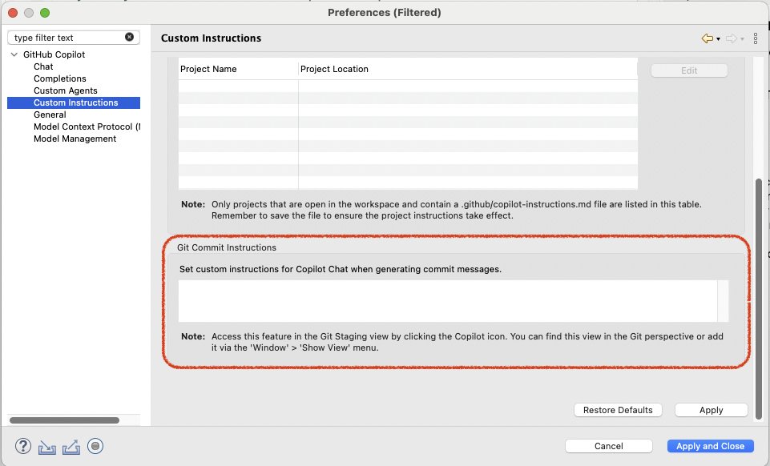

# GitHub Copilot 0.15.0 Release Notes
### MCP Registry
Discover and install MCP servers from a centralized registry with just a few clicks. Browse available servers, view their capabilities, and add them to your workspace instantly — no manual configuration required.

<video controls="true" src="./0.15.0/mcp_registry.mp4" title="MCP Registry" style="max-width: 800px; width: 100%; height: auto;"></video>

---

### Chat View UX Enhancements
We've refreshed the chat experience with several improvements:

- **Font Size Control**: Adjust the chat view font size to your preference using keyboard shortcuts or the view menu. Use `⌘ + =` / `⌘ + -` on macOS or `Ctrl + =` / `Ctrl + -` on Windows/Linux. Make it easier on your eyes!
- **Dark Theme Refresh**: A polished dark theme with improved contrast and readability for those late-night coding sessions.
- **Undo/Redo Support**: Made a typo in your chat input? Now you can undo and redo your edits seamlessly.

<video controls="true" src="./0.15.0/chat_ux_improvements.mp4" title="Chat UX Improvements" style="max-width: 800px; width: 100%; height: auto;"></video>

---

### Editor Selection Context
Copilot now automatically includes your current editor selection in the chat context. Simply select some code, open the chat, and Copilot already knows what you're working with — making your conversations more relevant and focused.

<video controls="true" src="./0.15.0/editor_selection.mp4" title="Editor Selection Context" style="max-width: 800px; width: 100%; height: auto;"></video>

---

### Manage Todo List Tool
Stay organized with the new Todo List feature. When working on complex tasks, Copilot can now create and manage a structured todo list to track progress and plan steps. Watch as todos are checked off in real-time while the agent works through your request — giving you clear visibility into what's done and what's next.

---

### New Preferences
Fine-tune your Copilot experience with new preference options:

- **Agent Max Requests**: Control how many requests the agent can make before asking to reply 'continue', giving you more control over large, complex tasks.

  

- **Commit Instructions**: Customize how Copilot generates commit messages to match your team's conventions and style.

  

---

# GitHub Copilot 0.14.0 Release Notes
### Native Toolbar Integration
The buttons that used to sit on the chat view’s top bar have now found a new home in the Eclipse view’s toolbar. This change makes the interface feel more natural and integrated with your workflow.

Note: If you cannot see the new buttons, please delete the **workbench.xmi** file located at: `<your_workspace>/.metadata/.plugins/org.eclipse.e4.workbench/`.

---

### New Changed Files Panel
The new changed files panel is now scrollable, collapsible, and expandable, so you can dive into details when you need them and tuck it away when you don’t.

<video controls="true" src="./0.14.0/changed_file_box.mp4" title="Changed Files Panel" style="max-width: 800px; width: 100%; height: auto;"></video>

---

This release also squashed bugs, boosted performance, and polished the UI for a smoother, faster experience.

Thank you for being part of this journey — here’s to an even better year ahead!

🎉 Wishing you a Happy New Year! 🎉

---

# GitHub Copilot 0.13.0 Release Notes
### Custom Agent
Custom agents bring customization to your chat mode by letting you specify name, description, tools, and models. Create specialized AI teammates tailored to your workflows and coding standards in Eclipse. Define agents using Markdown files that specify prompts so you can pick them up and run in your Eclipse quickly.

<video controls="true" src="./0.13.0/custom_agent.mp4" title="Custom Agent" style="max-width: 800px; width: 100%; height: auto;"></video>

---

### Plan
`Plan` helps AI think before it acts. It creates a clear plan first, so you can review and adjust it to fit your needs — then let the AI get to work. Simple, smart, and under your control.

<video controls="true" src="./0.13.0/plan.mp4" title="Plan" style="max-width: 800px; width: 100%; height: auto;"></video>

---

### Sub-agent
With Sub-Agent, your custom agents can now work in harmony under the guidance of a main agent. Each sub-agent tackles a specific task within its own isolated context, free from distractions — delivering sharper, more accurate results. Think of it as a team of specialists, each focused on what they do best, all orchestrated for maximum impact.

<video controls="true" src="./0.13.0/sub_agent.mp4" title="Sub-agent" style="max-width: 800px; width: 100%; height: auto;"></video>

---

### Copilot Coding Agent
With Copilot coding agent, GitHub Copilot can work independently in the background to complete tasks, just like a human developer: creating pull requests to solve issues in your GitHub repos.

<video controls="true" src="./0.13.0/coding_agent.mp4" title="Copilot Coding Agent" style="max-width: 800px; width: 100%; height: auto;"></video>

Note: [Click here to check more information](https://aka.ms/learn-copilot-coding-agent)

---

### Next Edit Suggestions (NES)

Next Edit Suggestions (NES) in GitHub Copilot predicts your next changes based on recent edits. It suggests updates to code, comments, and tests, which you can preview and apply instantly. Use Tab to move through suggestions and press Tab again to accept—keeping your workflow smooth and uninterrupted.

<video controls="true" src="./0.13.0/nes.mp4" title="NES" style="max-width: 800px; width: 100%; height: auto;"></video>

---

### Auto Model
Auto optimizes for model availability, currently routing to GPT-5, GPT-5 mini, GPT-4.1, Sonnet 4.5, and Haiku 4.5, depending on your subscription type. More models are coming soon.
