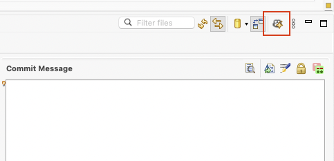
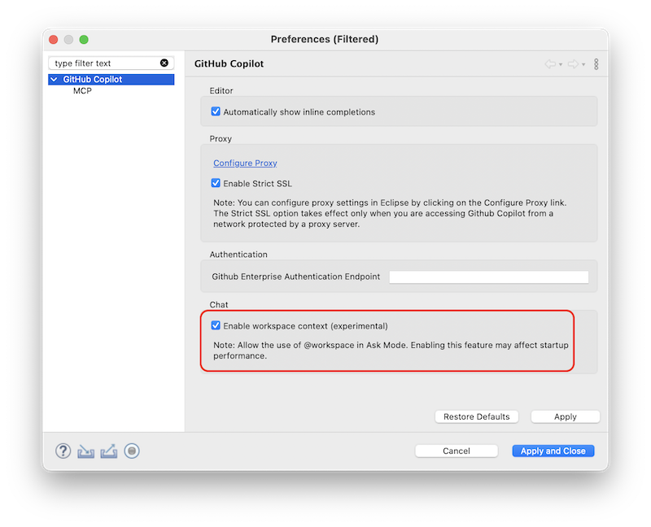
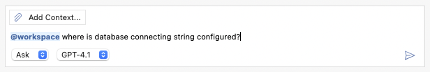
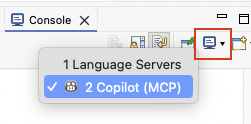
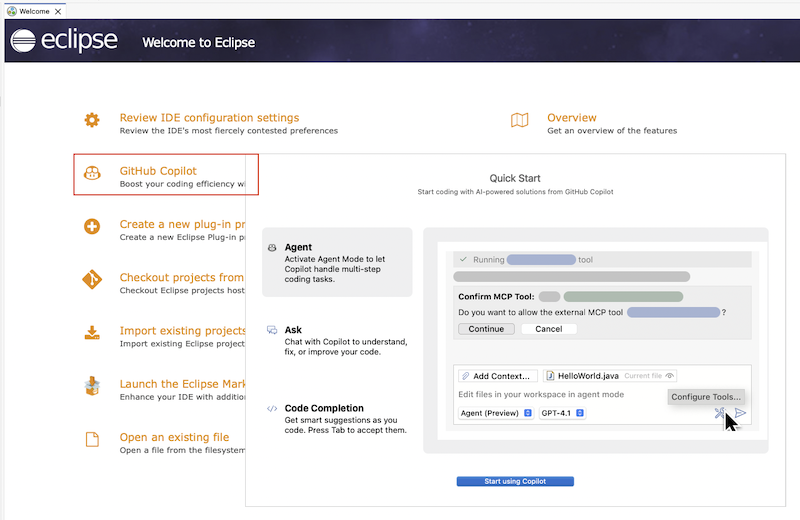
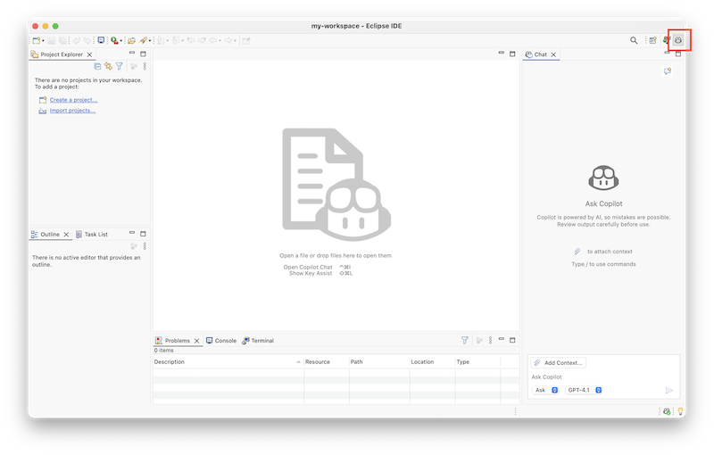

# GitHub Copilot 0.9.0 Release Notes
### GitHub Copilot Now Supports Eclipse 2024-03 & 2024-06!
We’re thrilled to announce that GitHub Copilot is now fully compatible with **Eclipse 2024-03** and **2024-06**! Whether you're coding in the latest release or just upgraded, you can now enjoy the full power of Copilot’s AI assistance right inside your Eclipse IDE.

---

### One-Click Commit Messages Generation with Copilot
You can now automatically generate meaningful Git commit messages with a single click. Just head to the **Git Staging** view and hit the **Generate Commit Message With Copilot** button in the toolbar. Copilot will analyze your staged changes and suggest a clear, concise message.



---

### Making Chat An Expert with @workspace Context
You can now supercharge your prompts in **Ask Mode** using the new @workspace context!

To enable it:

1. Head to GitHub Copilot Preferences
2. Check the box for Enable workspace context



Once enabled, Copilot can understand and respond based on your entire codebase—just use **@workspace** in your questions.



---

### Dive into MCP Logs in Console View
You can now view **detailed logs** from your configured MCP servers directly in the Console View. Just toggle to **Copilot (MCP)** and explore the insights.



---

### A Smoother Start: Revamped Getting Started Experience

We’ve reimagined the onboarding journey to make it easier than ever to get started with GitHub Copilot in Eclipse:

1. **Quickstart Guide**: A step-by-step walkthrough to get you up and running.

   
2. **Dedicated Perspective**: A new layout tailored for Copilot workflows. To enable the **Copilot** perspective, go to **Window** > **Perspective** > **Open Perspective** > **Other...** > **Copilot**

   
3. **Refined Chat View**: The Copilot Chat interface has been polished with a cleaner layout and a more intuitive default placement across commonly used Eclipse perspectives.

---

### Bug Fixes & Improvements
This release also includes bug fixes and enhancements to improve overall stability and user experience.

---

# GitHub Copilot 0.8.0 Release Notes

### Remote MCP Server support
Now user can configure remote MCP server in the MCP preference page, below is an example of remote GitHub MCP Server with PAT:

```javascript
{
  "servers": {
    "github": {
      "url": "https://api.githubcopilot.com/mcp/",
      "requestInit": {
        "headers": {
          "Authorization": "Bearer <yourToken>"
        }
      }
    }
  }
}
```

_Note: OAuth authorization is not supported right now._

### Bug Fixes & Improvements
This release also includes bug fixes and enhancements to improve overall stability and user experience.

# GitHub Copilot 0.7.0 Release Notes

## Feature Highlights
This release introduces a **new billing model** with support for premium requests in GitHub Copilot for Eclipse, enhanced chat usability with **Chat input history navigation**, **quick access to Agent Mode tool configuration**, and a range of **bug fixes and performance improvements**.

### Billing for GitHub Copilot Update
Starting **June 4, 2025**, a new billing model and updated user interface will be introduced in GitHub Copilot for Eclipse for all plans.

Your Copilot plan now includes [Premium requests](https://docs.github.com/en/copilot/managing-copilot/monitoring-usage-and-entitlements/about-premium-requests#premium-features), which provide access to more advanced models and features. These requests count against your monthly premium request allowance, calculated based on the [Model multipliers](https://docs.github.com/en/copilot/managing-copilot/monitoring-usage-and-entitlements/about-premium-requests#model-multipliers).

Read more on [About premium requests](https://docs.github.com/en/copilot/managing-copilot/monitoring-usage-and-entitlements/about-premium-requests) and [About billing for GitHub Copilot](https://docs.github.com/en/billing/managing-billing-for-your-products/managing-billing-for-github-copilot/about-billing-for-github-copilot).

### Chat Input History Navigation
You can now use the `Up` and `Down` arrow keys to navigate through your previous chat inputs, making it easier to reuse or revise past prompts.

### Quick Access to Agent Mode Tool Configuration
Click the `Tools` icon in the chat input box to quickly open the preferences page and configure your MCP tools.

### Bug Fixes & Improvements
This release also includes bug fixes and enhancements to improve overall stability and user experience.
