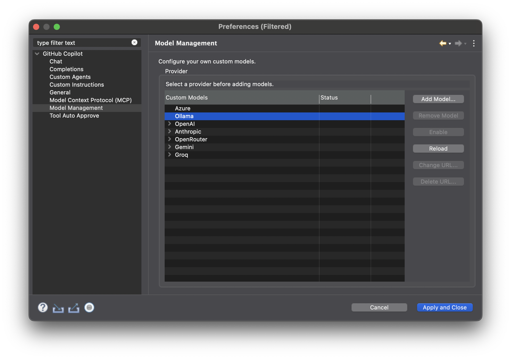

# GitHub Copilot 0.21.0 Release Notes

### Use Ollama Models with BYOK
You can now connect Ollama as a custom Bring Your Own Key (BYOK) model provider and use locally hosted models in Copilot Chat.

---

### Agent Skills Are Generally Available
Agent Skills are now generally available. Skills give Copilot reusable instructions and resources for specialized tasks, helping Agent Mode follow consistent workflows for your project.

---

### Sub-Agents Are Always Enabled
Sub-agent support is now always enabled in Agent Mode. Copilot can delegate focused tasks to sub-agents without requiring a separate setting, making complex work easier to parallelize.

---

### Semantic Workspace Search Removed
The semantic `@workspace` search integration has been removed. See [PR #373](https://github.com/microsoft/copilot-for-eclipse/pull/373) for details about this decision.

---

# GitHub Copilot 0.20.0 Release Notes

### Organization-Level Custom Models
Copilot for Eclipse now supports organization-enabled custom models in the model picker. If your organization has configured custom models, they appear automatically so you can select them alongside Copilot's built-in models.

---

### Faster and More Reliable Chat Rendering
The chat view now renders long and streaming conversations more efficiently, reducing slowdowns during agent sessions and editor switches.

This release also includes chat fixes so long conversations scroll correctly to the newest messages, prompts that need user action are brought into view automatically, and model details display better on Linux.

---

### Copilot Menu on the Left
The Copilot menu has moved to the left side of the Eclipse menu bar, immediately before the Help menu.

---

# GitHub Copilot 0.19.0 Release Notes

### Agent Tool Auto-Approve Controls
Agent Mode now supports auto-approve controls for tool confirmations. Configure rules for terminal commands, file operations, and MCP tools from Copilot preferences, or use the confirmation dialog's **Allow for Session** and **Always Allow** actions to keep trusted workflows moving without repeated prompts.

Default file safety rules, MCP tool annotations, and the global auto-approve toggle are supported, so you can reduce friction while keeping risky actions visible.

---

### Automatic Chat Context Compression
Copilot can now automatically compress chat context as conversations grow. When a session approaches the context limit, older conversation context is summarized so longer agent runs can continue with fewer interruptions.

The chat view also shows compression status while Copilot is compacting the conversation, making long-running sessions easier to follow.

---

### Create and Edit Local Files Outside the Workspace
Agent Mode can now create and edit local files by absolute path even when they are outside the Eclipse workspace. This helps when your code spans external folders, linked resources, or files that are not loaded as Eclipse projects.

Local file changes are tracked alongside workspace edits in the changed-files bar, with support for **View Diff**, **Keep**, and **Undo** flows, including empty-baseline diffs for newly created files.

---

### More Reliable Terminal Command Execution on Windows and Linux
Terminal command execution is more reliable across Windows and Linux. Copilot now runs commands through PowerShell on Windows and Bash on Linux, uses shell-integration markers to detect command completion and exit codes, and handles multiline commands with bracketed paste formatting.

Copilot also interrupts previous foreground commands before starting new ones, stops active terminal work when a chat request is canceled, truncates long terminal output before sending it back to the model, and chooses a better working directory from the current file or referenced files.
